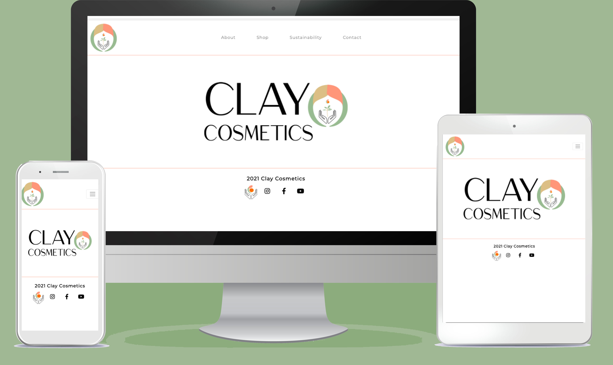
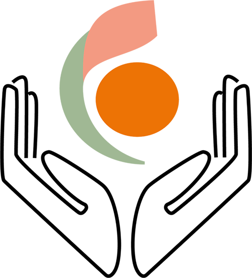
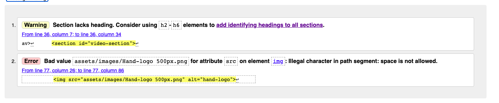
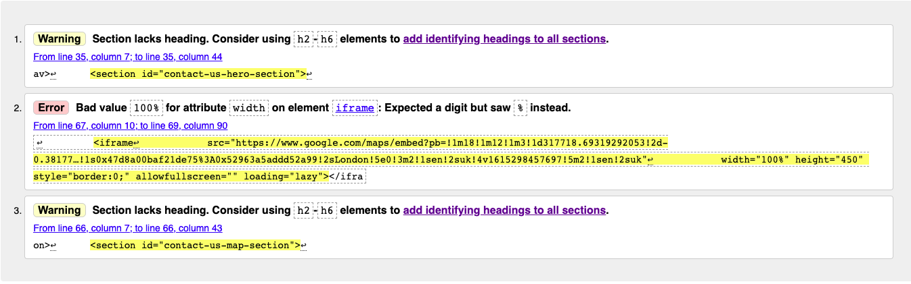
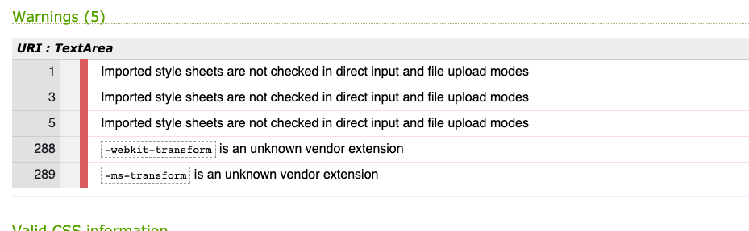

# Clay Cosmetics

This website is about a natural vegan friendly product called - Clay Cosmetics.
This product provides a range of beauty products the vary from skin care to make-up.
The purpose of this website is to sell the products from the company Clay Cosmetics and to provide 
infomation behind the story of the company and its values. The company not only wants to sell, but wants
to show their customer what they are doing in the beauty world to be sustainable and cruelty free.
The user is able to contact the company and send a message if they have any questions about the product and 
is able to see where the company is located with the map provided.

    

# UX

My goal is to creat a user-friendly interative Data-Centric Development project. I want to keep my overall website
white and black as the actualy product has splashes of colour and I think the white background couples
up with the clean product that Clay Cosmetics is promoting.

### Ideal Visitor

#### For this brand

* Disposable Income
* Interested in sustainable products
* A person who is interested in looking after their skin

### Visitors to the site are searching for 

* Make-up and skin care products
* To purchase a gift

### This project is the best way to help them achieve these things because

This website is;
* Easy to navigate
* Has a clear layout with evenly spaced text and content
* Informs visitors about the product ingredients beging sold

# User Stories

* As a new user to the website I want to easily navigate the site, so I can find what I need effectivly.
*To visit a website where I can easily view products with the prices
*To visit a website where I can read about the company 
*To find out about their brand and their values
*Find out who the people who run the compnay are
*To visit the website on different devices such as Mobile, Laptop and Ipad. 

### Design

When designing this website I looked at other beauty or fashion websites to get an understanding of their approaches of design.
I took into consideration of how I felt when visiting a page and what I liked to see on a website. I found a lot of beauty and fashion 
websites are minimal with little colour. They will often use white as their background colour which I personally prefer as a user.

### Colour

 I chose to use white as the main colour for my design. I found that using white refected my 'minimal' and 'sustainable' brand.
I created the logo myself which gave me the freedom to spefically choose the colour style and theme throughout the website. The branding colours 
has a rich Orange with complimenting calmer tones such as the light Pink and Green. This combination creates a harmony that can add with each
page, so the website has flashes of colour that is subtle but not too overloaded.

### logo

 I created the main logo based on two letter 'C's' that stand for 'Clay Cosmetics' I wanted have a logo that had a reflection of the name of 
the brand. Circular symbols also denote togethernes and harmony, so by making this logo a cirlce it also gave the website a calm feel. This is something
very important through this site. As the whole brand represents being good to one's self and being to the planet.

    

 The hand is a representation of clay. I wanted to combine the making of clay to the logo and the product.
As the product has all natural ingredientds such as clay being natural and from the earth, so instead of having an image
of actual clay, I wanted a more subtle connotation.

    

### Font

 I used two main for throughout my site. For my Title I used a font called 'Shippori+Mincho' which is a serif font.
I really like serif fonts for luxurious websites, I think it gives a more expensive feel and more editorial. I like how they use 
serif fonts in Vogue magazine which is matched with a sans serif font. In this case I used Montserrat as I am aware after some research that
Montserrat font is a strong, clear web font to use.I think it is important to not go too over board with body text as the user needs to be able to read and understand what they are reading.
I finally then added some 'script' font called Homemade+Apple, I feel that this just added a homemade, hands effect to the site and brand.

>

# Branding idea and mood board.

    

# Wireframes

 I used Balsamiq to create my wireframes for my website. Please click on the link below to acess the wireframe folder.
<a href=https://github.com/hayleyjones18/claycosmetics/tree/master/Docs/Wireframe-Desktop>Click here to access wireframe folder

 
 # About website pages

### Homepage

 For the home page, I wanted to keep it really minimal and for th user to be introduced with the logo
and get a feel about the simplicity of how the page will flow.

### About

The about page has information about the brand, it is the second page of the website and it is an introduction
for the the user about brnad what the brand represents, the values of the compnay and a section to 'meet the team' 
This give a more personal touch for the user to make them feel more connect with the people who work at Clay Cosmetics.

### Sustainability 

 The page talks about how their product is a sustainable commodity and to inform the user what Clay 
Cosmetics is doing to ensure that their product is sustainable for the planet and is a friendly product to use on your skin
without any nasty chemcials

### Contact

This page has an input form where you can send an email to the Clay Cosmetic team and a navigation map where 
you can find out where Clay Cosmetics is located

### Error Page 

Added a 404 page for visitors to be directed to if they clicked on the wrong page

# Technologies Used

### Languages

* HTML
* CSS 

### Websites

* Bootstrap (4.3.1)
* Font Awesome (5.11.2)
* Google Fonts
* Slack - Used during development and testing to find the solutions to problems enountered, getting help from other developers.
* Code Institute. Used to review concepts covered in preceding modules and walk-through projects.
* Google Chrome Developer Tools. Used throughout the project to test the responsiveness of elements, 
to target and apply CSS styles during the design phase and to test the site's performance once built.
* Github. Used to host the deployed site and used as a respository for all previous versions of the build.
* Gitpod. Used to build and develop the website.
* W3C CSS Validation Service. Used to validate the CSS file.
* W3C HTML Validation Service. Used to validate the HTML files.
* W3 Schools- To access code and to learn how to tackle new code.

### Software 

* Photoshop - to mock up my website onto computer screens
* Balsamiq - To create wireframes

### Frameworks

* Bootstrap Framework. Used to structure the website layout and ensure that it was responsive on all devices.

# Features

 This site is a 5 page navigation website with various sections on each page. 
This includes an input form to contact the brand. A map to find out where the company is located, and a video feature on sustainable page 
to add to the calming effect.

# Testng

### Debugging
### Solved bugs

1: My entire content of my website had an overflow on everypage. I was left with white space on 
the left on my screen

 To solve this problem I used the Chromb devl tools to detect the error and became aware of a container that was
placed outside of my footer tage. I now know that my container tag needs to be nested inside of my footer after speaking to other coders
and the research online

< 2: After resolving the footer bug. I still had an overflow on my Sustainability page. I again used the dev tools to find the bug
and was able to find that on the sustainability.html page the container was closed prematurely, And there was a stray row, existing on it's own 
outside of the normal structure/p>

The way this bug was solved is by Nesting that row inside that container which stopped the overflow 

 3: When I thought my overflow issue was solved, I found another overflow on my contact page again. This time, this 
issue was due to my col's so I have a hero image at the top of the page. And for that row and the proceeding for with the form, 
I had a col , this isn't needed as I had col-sm-12 and then col-md-12 <---- col being the smallest thing will allocate the elements
 as much space as it needs meaning it never gets to the col-sm-12 

To fix this I had to remove the col and also add a Bootstrap class to the image element
 called img-fluid <-- this will make sure the image is responsive.

* [W3C HTML Validator](https://validator.w3.org/) to validate HTML 
* [W3C CSS Validator](https://jigsaw.w3.org/css-validator/)
* I tested it using Chrome developer tools and different devices. 

#### HTML Validator

 I used the the W3C  HTML Validator to validate my HTML code I was faced with some errors on every page. 
This error was an "alt" problem. I had not added an value to my alt attribute, so once this had been amened, these problems were fixed.

 An error was found with another img tag and my img file name had a space. I corrected this by simply removing the space and adjusting this 
new renamed image file to all relevant pages 

    

 In my Sustainability and contact page I had a warning telling me that in my video and map sections html code sI hadn't 
used any heading elements within it. It's a semantic warning. I chose to wish ignore it as I didnt think it was needed as I did not want a heading to go with
my video. 

I had to move width and height attributes from HTML to CSS in my Iframe tag as this was causing an error

    

### Error in my committed

 90c7b9a accidently wrote 'http.server' - this error was probably made from attempting to open up my browser preview-not to commit

#### CSS Validator 

the validator threw -webkit-transform & -ms-transform as a warning but I got it from running your css through an 
autoprefixer to ensure cross browser optimisation.

import error is telling me that the validation can't perform a validation on those as they are 
explicit import from an externally hosted file.

    

# Credit:

## Code used from websites

* Email form on contact page [W3 School](https://www.w3schools.com/howto/howto_css_contact_form.asp) Contact form
* Navigation bar [Bootstrap Nav Bar](https://getbootstrap.com/docs/4.4/components/navbar/) Nav Bar

## Content

The text, images, links and other data in the database was sourced from various local websites including but not limiting too.

* All the pictures were taken from Adobe Stock, Unplash.
* W3school for input email form
* Website that inspired my text content [Kjarweis](https://kjaerweis.com/blogs/magasinet/hygge)
* Website inspired text [Sweaty Betty](https://www.sweatybetty.com/responsibility)
* Video credited from [Youtube Video](https://www.youtube.com/watch?v=r3fE6FQT82s&t=46s)

# Deployment 

 This project was developed using github which is committed to git and pushed to github using the 
built in system

 To deploy this page to Github pages from its Github repository, the following steps were taken

1. Login to Github
2. From the list of repositories on the screen, select 'Clay Cosmetics'.
3. From the menu items near the top of the page, select settings.
4. Scroll down to Github pages section.
5. Under source click the dropdown menu labelled 'none' and select 'master branch'
6. On selecting master branch the page is automatically refreshed, the website is now deployed.
7. Scroll back down to github pages section to retreive the link to the deployed website.

# How to run locally 

## To clone this project into gitpod you will need:

1. A github account. [Create a github account here](https://github.com/)
2. Use the Chrome browser

## Then follow these steps:

1. Install the Git pod browser extentions for Chromb
2. After installation, restart the browser
3. log into gitpod with your gitpod account
4. Navigate to the project github repository
5. Click the green 'gitpod' button in the top right corner of the repository.
6. This will trigger a new gitpod workspace to be created from the code in github where you can work locally.

